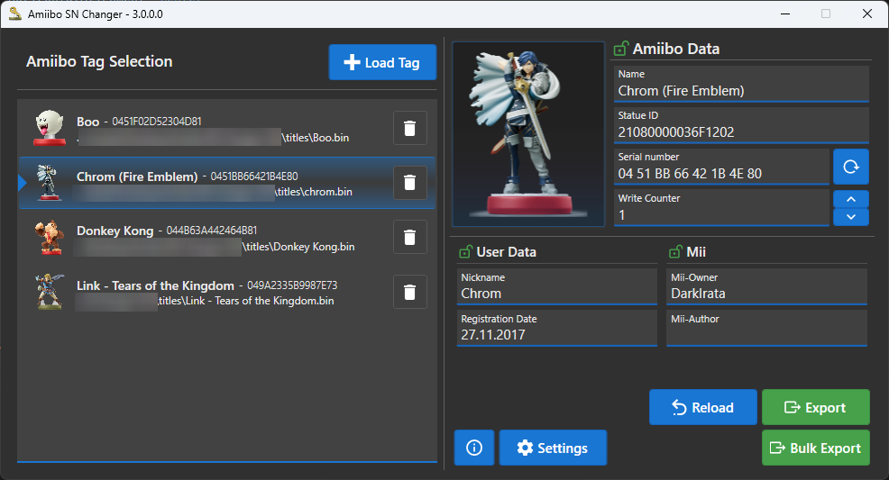

# AmiiboSN-Changer
Amiibo SN Changer allows to easily change the Unique Serial number of Amiibo Tags. Thanks to an easy to use UI, you can quickly import Amiibo Tags and either export a specific list or bulk export your whole list to a modified Amiibo Tag. This allows to use the same Amiibo multiple times in a game (for example TLoZ Breath of the Wild / TLoZ Tears of the Kingdom).

Since the console application (Version < 3.0) is written in dotnet, it should be possible to use the application on other platforms.
Tested with N2Elite and TagMo Backups

## Features
- Load and Save Amiibo Tag Dumps (.bin) or Flippter NFC Files (.nfc)
- Export multiple tags at once
- Download newest Amiibo Infos and Images from AmiiboAPI Repo | https://github.com/N3evin/AmiiboAPI
- Edit Nickname, and Mii Owner / Author (Only if you know what you are doing)
- Easy to use!
- Dark Mode 🤡

## Installation
Required is a key_retail.bin (MD5 45FD53569F5765EEF9C337BD5172F937) file.
The key_retail.bin is a binary merge of "unfixed-info.bin" and "locked-secret.bin"
On the first run, you will be asked for a file path.

If you don't use the Self-Contained Version, you need to have .NET 8 installed.
The first run requires an active internet connection to download Amiibo information data and Images.

## Usage - GUI
You can either use the "Load Tag" Button at the top or drag&drop your Amiibo .bin or .nfc files into the left field.
Press Export to export the currently selected Tag with your changes or Bulk Export the entire list with a randomized Serial number.



## Usage - Console (Pre Version 3.0)
To use the console application you require DotNet 2.1

For the portable build, call like in this example
```
dotnet "D:\AmiiboSN-Changer\ASNC.dll" -a "D:\AmiiboSN-Changer\Amiibos\8BitMario.bin" -c 2 -o "D:\AmiiboSN-Changer\Amiibos\Output"
```

## Credits
AnalogMan - Simpler Python Version and the idea for a wrapper Tool
Falco20019 - Awesome amiibo library (libamiibo)
0xz00n - Inspired the NFC generating code
pictogrammers - Icons

